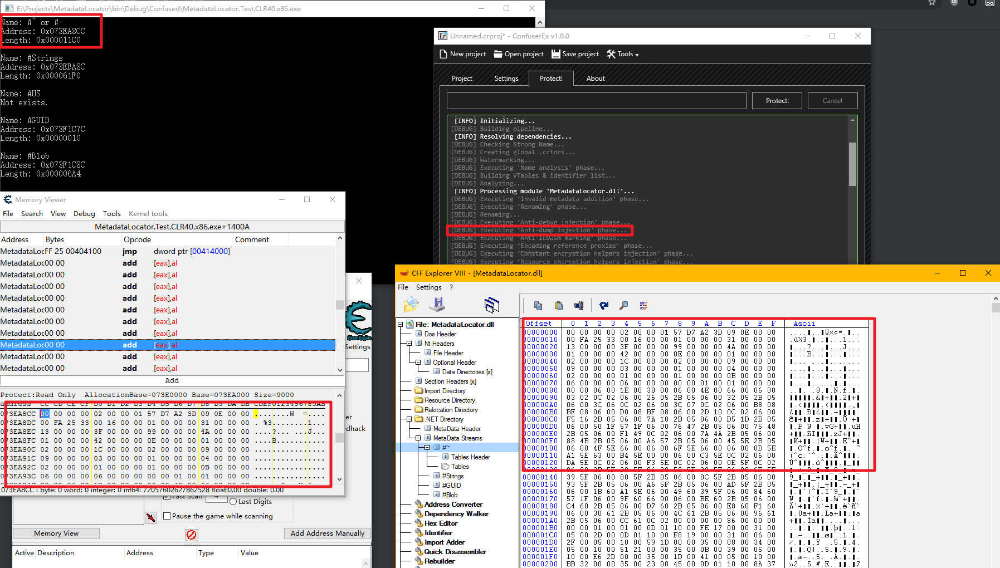

# MetadataLocator
Locate the address of .NET metadata by CLR to anti anti dump

Locate the table stream under the full protection of ConfuserEx (include AntiDump protection)

## Requirements
- Any .NET Framework

## Downloads
GitHub: [Latest release](https://github.com/wwh1004/MetadataLocator/releases/latest/download/MetadataLocator.zip)

AppVeyor: 
